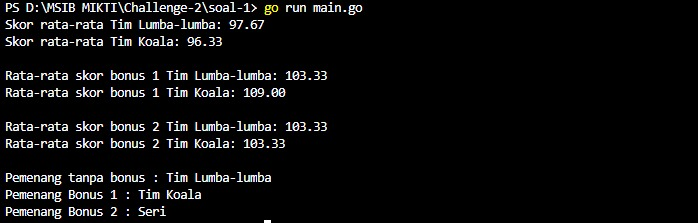
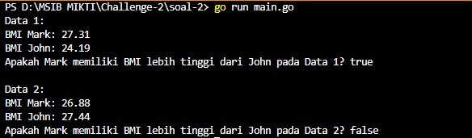

# Challenge-2
Tugas SIB MIKTI Golang Backend

Nama : Mohamad Rizki Adinsyah

Kelas : GO-1

Code soal No1
package main

import "fmt"

func calculateAverage(scores []int) float64 {
	total := 0
	for _, score := range scores {
		total += score
	}
	return float64(total) / float64(len(scores))
}

func main() {
	// Data uji
	scoresLumba := []int{96, 108, 89}
	scoresKoala := []int{88, 91, 110}

	// Menghitung skor rata-rata
	averageLumba := calculateAverage(scoresLumba)
	averageKoala := calculateAverage(scoresKoala)

	// Menampilkan hasil rata-rata skor
	fmt.Printf("Skor rata-rata Tim Lumba-lumba: %.2f\n", averageLumba)
	fmt.Printf("Skor rata-rata Tim Koala: %.2f\n", averageKoala)

	// Data Bonus 1
	bonusScoresLumba1 := []int{97, 112, 101}
	bonusScoresKoala1 := []int{109, 95, 123}

	// Menghitung rata-rata skor bonus 1
	averageBonusLumba1 := calculateAverage(bonusScoresLumba1)
	averageBonusKoala1 := calculateAverage(bonusScoresKoala1)

	// Menampilkan rata-rata skor bonus 1
	fmt.Printf("\nRata-rata skor bonus 1 Tim Lumba-lumba: %.2f\n", averageBonusLumba1)
	fmt.Printf("Rata-rata skor bonus 1 Tim Koala: %.2f\n", averageBonusKoala1)

	// Data Bonus 2
	bonusScoresLumba2 := []int{97, 112, 101}
	bonusScoresKoala2 := []int{109, 95, 106}

	// Menghitung rata-rata skor bonus 2
	averageBonusLumba2 := calculateAverage(bonusScoresLumba2)
	averageBonusKoala2 := calculateAverage(bonusScoresKoala2)

	// Menampilkan rata-rata skor bonus 2
	fmt.Printf("\nRata-rata skor bonus 2 Tim Lumba-lumba: %.2f\n", averageBonusLumba2)
	fmt.Printf("Rata-rata skor bonus 2 Tim Koala: %.2f\n", averageBonusKoala2)

	// Menentukan pemenang
	var winner, winner1, winner2 string

	if averageLumba > averageKoala {
		winner = "Tim Lumba-lumba"
	} else if averageKoala > averageLumba {
		winner = "Tim Koala"
	} else {
		winner = "Seri"
	}

	if averageBonusLumba1 > averageBonusKoala1 {
		winner1 = "Tim Lumba-lumba"
	} else if averageBonusKoala1 > averageBonusLumba1 {
		winner1 = "Tim Koala"
	} else {
		winner1 = "Seri"
	}

	if averageBonusLumba2 > averageBonusKoala2 {
		winner2 = "Tim Lumba-lumba"
	} else if averageBonusKoala2 > averageBonusLumba2 {
		winner2 = "Tim Koala"
	} else {
		winner2 = "Seri"
	}

	fmt.Printf("\nPemenang tanpa bonus : %s\n", winner)
	fmt.Printf("Pemenang Bonus 1 : %s\n", winner1)
	fmt.Printf("Pemenang Bonus 2 : %s\n", winner2)
}

- Outputnya

Code soal no2
package main

import "fmt"

func main() {
	// Data 1
	markWeight1 := 78.0
	markHeight1 := 1.69

	johnWeight1 := 92.0
	johnHeight1 := 1.95

	// Mengitung BMI untuk Mark dan John pada Data 1
	markBMI1 := markWeight1 / (markHeight1 * markHeight1)
	johnBMI1 := johnWeight1 / (johnHeight1 * johnHeight1)

	// Menentukan apakah Mark memiliki BMI yang lebih tinggi dari John pada Data 1
	markHigherBMI1 := markBMI1 > johnBMI1

	// Menampilkan hasil Data 1
	fmt.Println("Data 1:")
	fmt.Printf("BMI Mark: %.2f\n", markBMI1)
	fmt.Printf("BMI John: %.2f\n", johnBMI1)
	fmt.Printf("Apakah Mark memiliki BMI lebih tinggi dari John pada Data 1? %t\n\n", markHigherBMI1)

	// Data 2
	markWeight2 := 95.0
	markHeight2 := 1.88

	johnWeight2 := 85.0
	johnHeight2 := 1.76

	// Menghitung BMI untuk Mark dan John pada Data 2
	markBMI2 := markWeight2 / (markHeight2 * markHeight2)
	johnBMI2 := johnWeight2 / (johnHeight2 * johnHeight2)

	// Menentukan apakah Mark memiliki BMI yang lebih tinggi dari John pada Data 2
	markHigherBMI2 := markBMI2 > johnBMI2

	// Menampilkan hasil Data 2
	fmt.Println("Data 2:")
	fmt.Printf("BMI Mark: %.2f\n", markBMI2)
	fmt.Printf("BMI John: %.2f\n", johnBMI2)
	fmt.Printf("Apakah Mark memiliki BMI lebih tinggi dari John pada Data 2? %t\n", markHigherBMI2)
}

- outputnya

